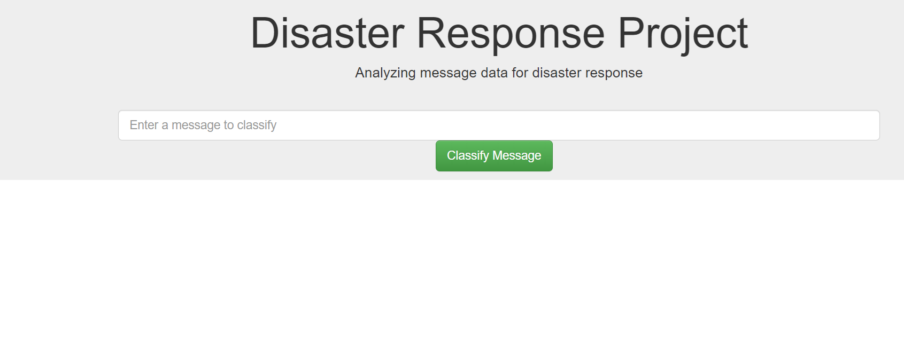

# Data Science - Udacity

# Disaster Response Pipeline Project

Udacity assigned disaster recovery project for their data engineering assignment to build a model for an API that classify disaster recovery messages.
The data sets contain real messages that were sent during disaster events. The task will be classifying the messages to send appropriate disaster recovering agency. 
Project components 

# 1.	ETL pipeline Run process_data.py to export data to a database file

•	Load message and categories data sets
•	Merge two data sets 
•	Cleans data 
•	Upload to SQLite DB

# 2.	ML pipeline Run train_classifier.py 

•	Loads data from the SQLite database
•	Splits the dataset into training and test sets
•	Builds a text processing and machine learning pipeline
•	Trains and tunes a model using GridSearchCV
•	Outputs results on the test set
•	Exports the final model as a pickle file

# 3.	Flask web app run.py to run web application

Open separate terminal window and run env|grep WORK
From the output of that, put in the URL that will replace https://SPACEID-3001.SPACEDOMAIN 
as example https://viewa7a4999b-3001.udacity-student-workspaces.com/"  

Enter text to classify  and getting output 

 

## Basic Overview of Training Data Sets

Proportion of message categories 

 

## Enter Water in message box 

 

 
